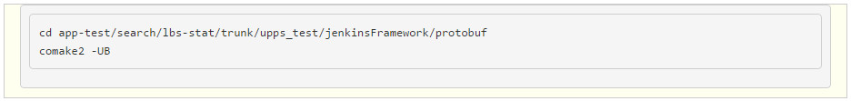
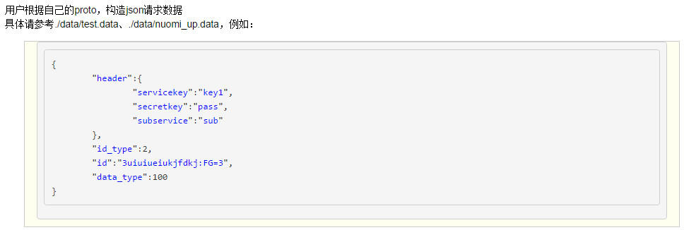
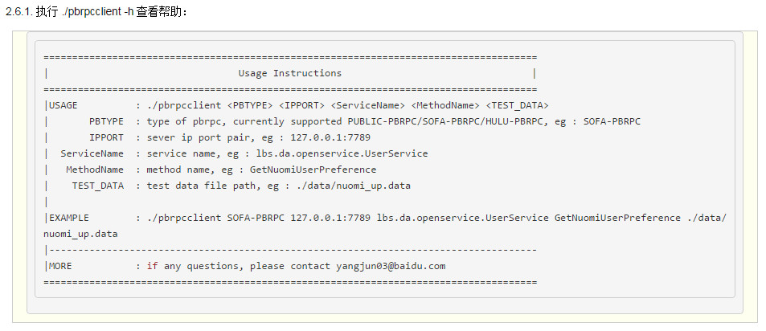
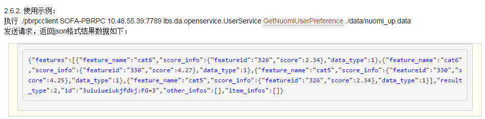

pbrpcclient
===========

通用PBRPC客户端请求工具

### 简介:
* 简单、易用、通用的PBRPC客户端请求工具，不需要写代码。
* 支持发送多种PBRPC协议请求：PUBLIC-PBRPC、SOFA-PBRPC、HULU-PBRPC。
* 支持json格式数据做为请求源、支持返回数据json输出。

### 使用:
* * 获取工具：    
     
* * 获取依赖：    
     
* * 提供proto文件：    
     
* * 生成测试工具：    
     
* * 准备json格式请求数据：    
     
* * 发送请求：    
     
    

